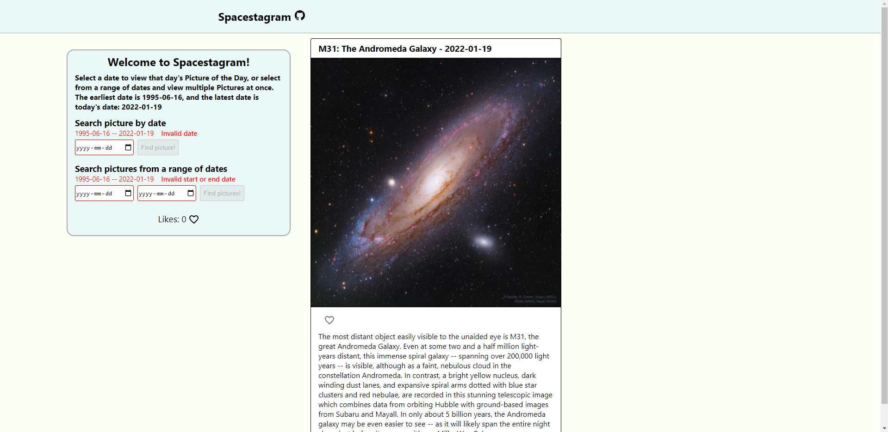
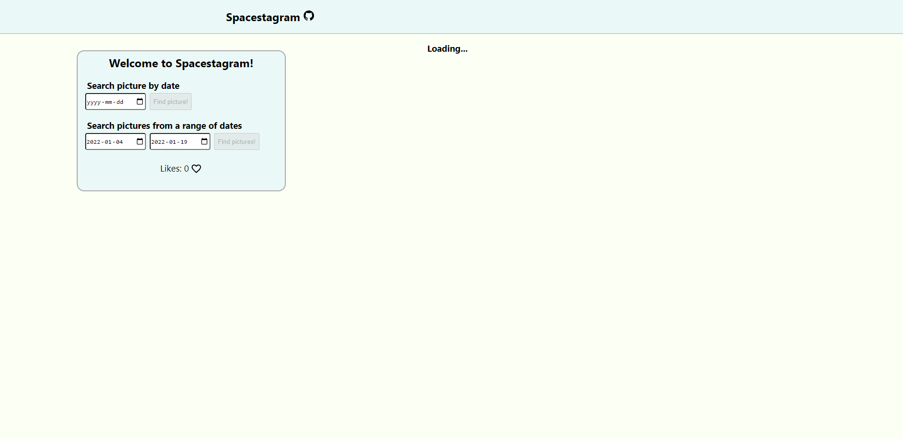
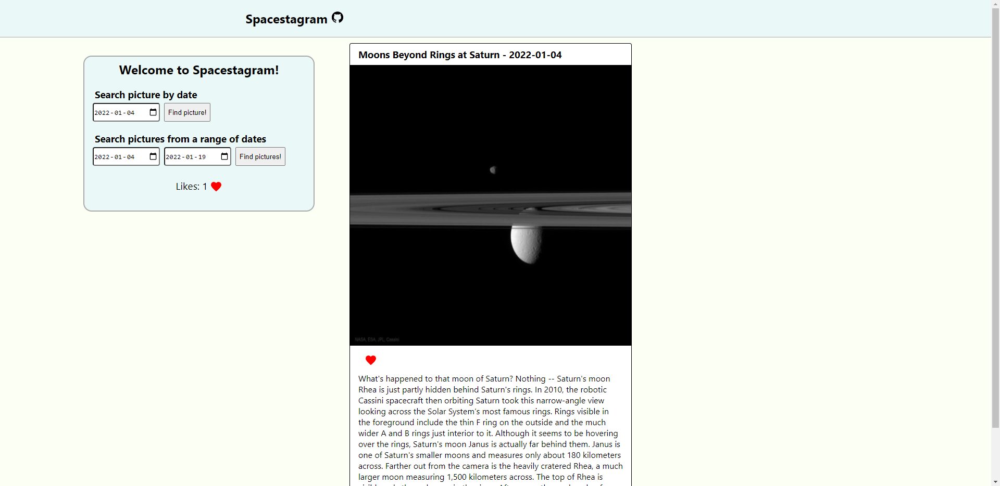
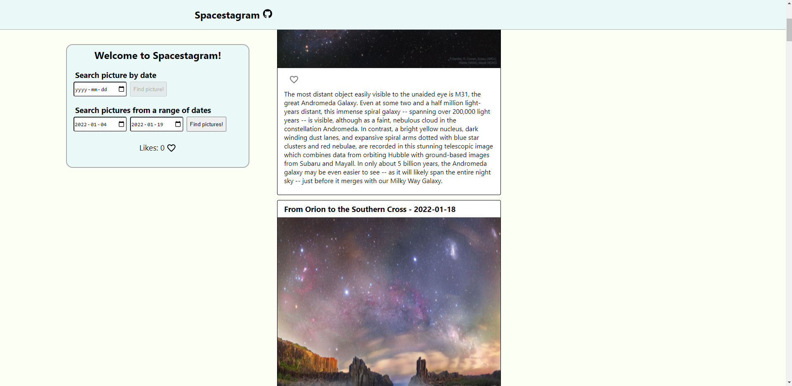
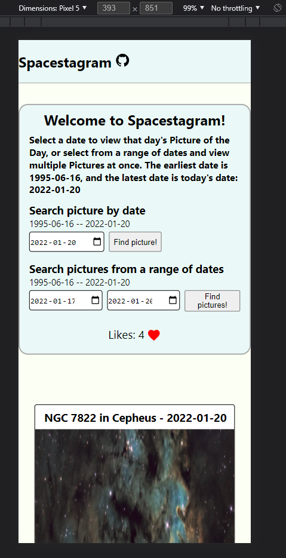

# Spacestagram

- [Link to web app](https://atu-spacestagram.herokuapp.com/)
- Shopify Challenge for Summer 2022 Front-End Development Intern
- Developed by Anson Tu

# Development

- [Challenge Requirements](https://docs.google.com/document/d/13zXpyrC2yGxoLXKktxw2VJG2Jw8SdUfliLM-bYQLjqE)
- Developed using React and TypeScript
- Page and components stylized using styled-components
- Icons provided by Material-UI
- Hosted on Heroku

# Features

- Clicking the `Spacestagram` header text will link to application's GitHub repository
- Initially, the web app will load the picture of the day
- To view a different "picture of the day", select a date from the first date picker, and click "Find picture!"
- To view multiple "picture of the day", select a start and end date from the second and third date pickers respectively, and click "Find pictures!"
- While the application is loading the pictures, the loading text will be displayed as a placeholder
- Once the posts are finished loading, if there are multiple posts, scroll vertically to see each one
- All posts can be liked or unliked by clicking on the heart icon under the image/video, and the total number of likes is displayed on the left
- Previously liked posts will keep their state even after the page is refreshed or closed, as liked posts are saved in local storage
- The buttons for searching pictures will be disabled if an error has occurred, or the page is still loading a previous request
  - Errors include choosing a date outside the bounds of the date boundaries (1995-06-16 to present date), and having the start date after the end date
  - If there is an error with the date picker or date range picker, an error message will appear above it

# Demo

# Home Screen

# Loading Screen

# Liked Post

# Multiple Posts

# Mobile View

